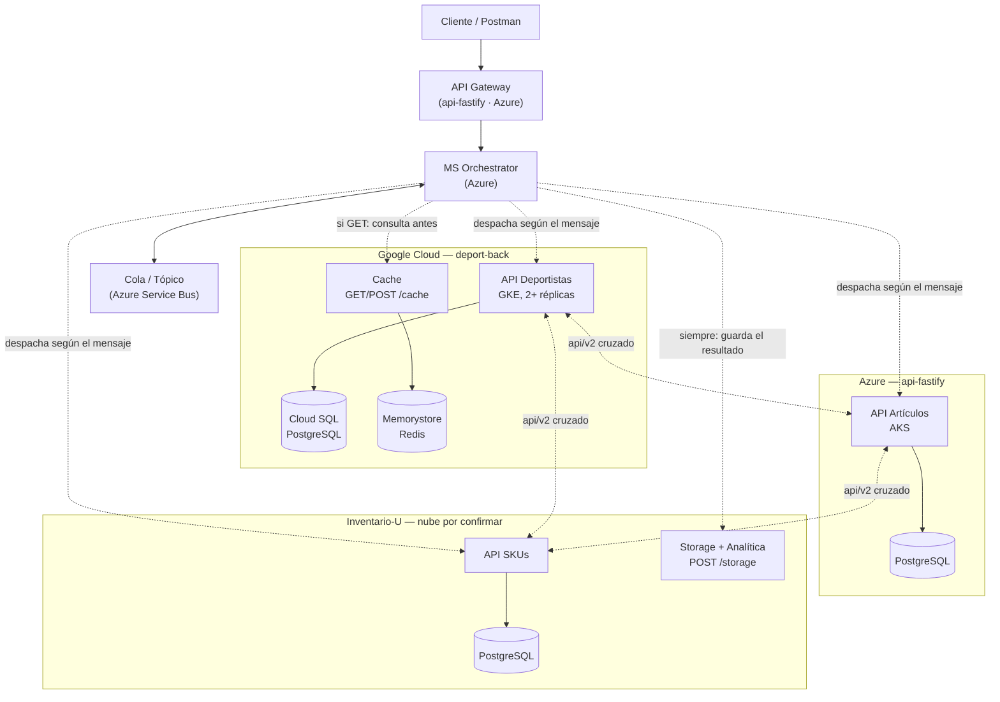

<p align="center">
  <a href="http://nestjs.com/" target="blank"></a>
</p>

[circleci-image]: https://img.shields.io/circleci/build/github/nestjs/nest/master?token=abc123def456
[circleci-url]: https://circleci.com/gh/nestjs/nest

  <p align="center">A progressive <a href="http://nodejs.org" target="_blank">Node.js</a> framework for building efficient and scalable server-side applications.</p>
    <p align="center">
<a href="https://www.npmjs.com/~nestjscore" target="_blank"></a>
<a href="https://www.npmjs.com/~nestjscore" target="_blank"></a>
<a href="https://www.npmjs.com/~nestjscore" target="_blank"></a>
<a href="https://circleci.com/gh/nestjs/nest" target="_blank"></a>
<a href="https://discord.gg/G7Qnnhy" target="_blank"></a>
<a href="https://opencollective.com/nest#backer" target="_blank"></a>
<a href="https://opencollective.com/nest#sponsor" target="_blank"></a>
  <a href="https://paypal.me/kamilmysliwiec" target="_blank"></a>
    <a href="https://opencollective.com/nest#sponsor"  target="_blank"></a>
  <a href="https://twitter.com/nestframework" target="_blank"></a>
</p>
  <!--[](https://opencollective.com/nest#backer)
  [](https://opencollective.com/nest#sponsor)-->

## Description

[Nest](https://github.com/nestjs/nest) framework TypeScript starter repository.

## Arquitectura multicloud (Seguimiento #2)



| Nube | Integrante | Componente propio | Componente transversal |
|---|---|---|---|
| **Google Cloud** | `deport-back` (este repo) | API Deportistas (GKE + Cloud SQL) | **Cache** distribuida (Memorystore) |
| **Azure** | api-fastify | API Artículos (AKS + PostgreSQL) | **Orchestrator + Cola** (Service Bus) + API Gateway |
| Inventario-U | Inventario-U | API SKUs | **Storage + Analítica** |

Un identificador de correlación (`X-Trace-Id`) se propaga en cada llamada entre nubes — si la petición
ya lo traía, se respeta; si no, `deport-back` genera uno nuevo y lo devuelve en la respuesta. Ver la
sección "Trace-id" más abajo.

## Project setup

```bash
$ pnpm install
```

## Local database with Docker

```bash
# create your local env file
copy .env.local.example .env.local

# start postgres
docker compose up -d
```

Then run the API with:

```bash
pnpm run start:dev
```

## Compile and run the project

```bash
# development
$ pnpm run start

# watch mode
$ pnpm run start:dev

# production mode
$ pnpm run start:prod
```

## Integración con APIs externas (v2)

`GET /api/v2/deportistas/:id` es un controller aparte (`DeportistasV2Controller`) que, además del deportista, trae pegada la respuesta cruda de las APIs de los otros 2 equipos: `api-fastify` (`/articulos`) e `Inventario-U` (`/skus`). Si alguna de las dos no responde, no rompe la respuesta: queda un `{ error }` en esa clave y el resto sigue funcionando. El `GET /deportistas` y `GET /deportistas/:id` normales (v1) no cambian.

Variables de entorno necesarias (agregar en `.env` / `.env.local`):

```
API_FASTIFY_URL=http://localhost:3001
INVENTARIO_U_URL=http://localhost:8000
```

Ejemplo de respuesta:

```json
{
  "deportista": { /* ... */ },
  "apis_externas": {
    "api_fastify": [ /* artículos de api-fastify, o { "error": "..." } */ ],
    "inventario_u": [ /* skus de Inventario-U, o { "error": "..." } */ ]
  }
}
```

### API key compartida entre los 3 equipos

Si `TEAM_API_KEY` está configurada, todos los endpoints exigen el header `X-Api-Key` con ese
mismo valor (401 si falta o no coincide) — y `deportistas.service.ts` lo manda automáticamente
al llamar a `api-fastify` e `Inventario-U`. Si `TEAM_API_KEY` **no** está configurada, la API
sigue funcionando abierta (para no bloquear a nadie mientras cada equipo la va armando).

```
TEAM_API_KEY=<la key compartida por el equipo>
```

### Caché distribuida (Redis)

Las respuestas de `api-fastify` e `Inventario-U` que trae `GET /api/v2/deportistas/:id` se
guardan 30 segundos en Redis (`CacheDistribuidaService`), para no golpear a las 2 APIs externas
en cada request. Si Redis no está configurado o no responde, el endpoint sigue funcionando igual,
simplemente sin caché (no rompe nada, solo pierde el ahorro).

```
REDIS_HOST=localhost
REDIS_PORT=6379
```

En producción `REDIS_HOST` apunta a la IP interna de una instancia de **Memorystore for Redis**
(ver sección de despliegue en GKE más abajo) — es la misma caché para las 2 réplicas de la app,
por eso es "distribuida" y no un cache en memoria de cada pod por separado.

### Cache (componente transversal)

En la arquitectura de seguimiento, `deport-back` es el componente transversal de "Cache" para el
resto de servicios (por ejemplo el Orchestrator del equipo de la cola): expone la misma caché
distribuida de arriba por HTTP, para que cualquier otro servicio pueda usarla sin tener su propio
Redis. El "Gateway" que aparecía junto a la caché en el diagrama original lo termina implementando
otro equipo (api-fastify), no `deport-back`.

```
GET /cache/:key
```
Devuelve `{ "key": "...", "value": ... }` si existe, `404` si no existe o ya expiró.

```
POST /cache
Body: { "key": "articulos:api-fastify", "value": { "cualquier": "json" }, "ttl": 60 }
```
Guarda `value` bajo `key` por `ttl` segundos (opcional, por defecto 60, máximo 3600). Devuelve
`{ "key": "...", "ttl": 60 }`.

```
DELETE /cache/:key
```
Política de invalidación: borra la entrada antes de que expire sola (por ejemplo, si alguien
actualiza un dato en tiempo real y no se quiere esperar el `ttl`). Devuelve `204` siempre, exista
o no la key.

Como el resto de la API, exige el header `X-Api-Key` si `TEAM_API_KEY` está configurada.

### Trace-id (correlación entre nubes)

Toda petición que llega recibe un `X-Trace-Id`: si ya lo trae (porque viene del Gateway o del
Orchestrator, que lo deben propagar), se respeta; si no, `deport-back` genera uno nuevo con
`crypto.randomUUID()`. Se devuelve en el header de la respuesta, se manda como header hacia
`api-fastify`/`Inventario-U` en las llamadas del `api/v2`, y aparece en los logs de la app —
así un mismo mensaje se puede seguir en `kubectl logs` aunque haya cruzado 3 nubes distintas.

## Run tests

```bash
# unit tests
$ pnpm run test

# e2e tests
$ pnpm run test:e2e

# test coverage
$ pnpm run test:cov

# tests in docker
$ pnpm run test:docker
```

## Deployment

When you're ready to deploy your NestJS application to production, there are some key steps you can take to ensure it runs as efficiently as possible. Check out the [deployment documentation](https://docs.nestjs.com/deployment) for more information.

If you are looking for a cloud-based platform to deploy your NestJS application, check out [Mau](https://mau.nestjs.com), our official platform for deploying NestJS applications on AWS. Mau makes deployment straightforward and fast, requiring just a few simple steps:

```bash
$ pnpm install -g @nestjs/mau
$ mau deploy
```

With Mau, you can deploy your application in just a few clicks, allowing you to focus on building features rather than managing infrastructure.

## Despliegue en Google Cloud (GKE)

Manifiestos de Kubernetes en `k8s/` para desplegar en Google Kubernetes Engine (GKE Autopilot),
usando el crédito gratis de $300 de GCP. La base de datos es **Cloud SQL for PostgreSQL** (gestionada
de verdad), a la que se conecta vía el **Cloud SQL Auth Proxy** como sidecar. Las credenciales viven
en **Secret Manager**; el Secret de k8s se crea a mano leyéndolas de ahí (el add-on de sincronización
automática de GKE quedó bloqueado por falta de capacidad de Google en la región — se puede volver a
intentar más adelante, ver comando abajo).

- `namespace.yaml`, `configmap.yaml` — configuración no sensible (`DB_HOST: 127.0.0.1`, donde escucha el proxy; `REDIS_HOST`, la IP interna de Memorystore)
- `serviceaccount.yaml` — ServiceAccount con Workload Identity (roles `cloudsql.client` y `secretmanager.secretAccessor`)
- `deployment.yaml` — 2 réplicas de la app + sidecar del Cloud SQL Auth Proxy, probes en `GET /`, requests/limits
- `service.yaml` — `LoadBalancer` para exponer la app
- `hpa.yaml` — autoescala de 2 a 5 réplicas al 70% de CPU

No hay pipeline de CI/CD para esto — el deploy es manual.

Build y push de la imagen a Artifact Registry (reemplazar región/proyecto):

```bash
docker build -t <region>-docker.pkg.dev/<project-id>/deport-back/deport-back:latest .
docker push <region>-docker.pkg.dev/<project-id>/deport-back/deport-back:latest
```

Crear la service account de GCP y darle los permisos (una sola vez):

```bash
gcloud iam service-accounts create deport-back-sa
gcloud projects add-iam-policy-binding <project-id> \
  --member="serviceAccount:deport-back-sa@<project-id>.iam.gserviceaccount.com" \
  --role="roles/cloudsql.client"
gcloud projects add-iam-policy-binding <project-id> \
  --member="serviceAccount:deport-back-sa@<project-id>.iam.gserviceaccount.com" \
  --role="roles/secretmanager.secretAccessor"
gcloud iam service-accounts add-iam-policy-binding \
  deport-back-sa@<project-id>.iam.gserviceaccount.com \
  --role roles/iam.workloadIdentityUser \
  --member "serviceAccount:<project-id>.svc.id.goog[deport-back/deport-back-sa]"
```

Crear la instancia de Memorystore for Redis (caché distribuida) y anotar su IP interna
(la usa `configmap.yaml` en `REDIS_HOST`; tiene que estar en la misma región/red que el cluster):

```bash
gcloud services enable redis.googleapis.com
gcloud redis instances create deport-back-cache \
  --size=1 \
  --region=us-central1 \
  --tier=basic \
  --redis-version=redis_7_0
gcloud redis instances describe deport-back-cache --region=us-central1 --format='value(host)'
```

Crear el Secret de k8s leyendo los valores directo de Secret Manager (`db-username`, `db-password`,
`db-name`, `team-api-key` ya creados ahí):

```bash
kubectl create secret generic deport-back-db -n deport-back \
  --from-literal=DB_USERNAME="$(gcloud secrets versions access latest --secret=db-username)" \
  --from-literal=DB_PASSWORD="$(gcloud secrets versions access latest --secret=db-password)" \
  --from-literal=DB_NAME="$(gcloud secrets versions access latest --secret=db-name)" \
  --from-literal=TEAM_API_KEY="$(gcloud secrets versions access latest --secret=team-api-key)"
```

Aplicar en el cluster:

```bash
kubectl apply -f k8s/namespace.yaml
kubectl apply -f k8s/configmap.yaml
kubectl apply -f k8s/serviceaccount.yaml
kubectl apply -f k8s/deployment.yaml
kubectl apply -f k8s/service.yaml
kubectl apply -f k8s/hpa.yaml
```

Si más adelante el add-on de Secret Manager para GKE deja de estar bloqueado por capacidad, se
puede volver a sincronizar automático con:

```bash
gcloud container clusters update deport-back-cluster --location=us-central1 --enable-secret-manager
```

## Resources

Check out a few resources that may come in handy when working with NestJS:

- Visit the [NestJS Documentation](https://docs.nestjs.com) to learn more about the framework.
- For questions and support, please visit our [Discord channel](https://discord.gg/G7Qnnhy).
- To dive deeper and get more hands-on experience, check out our official video [courses](https://courses.nestjs.com/).
- Deploy your application to AWS with the help of [NestJS Mau](https://mau.nestjs.com) in just a few clicks.
- Visualize your application graph and interact with the NestJS application in real-time using [NestJS Devtools](https://devtools.nestjs.com).
- Need help with your project (part-time to full-time)? Check out our official [enterprise support](https://enterprise.nestjs.com).
- To stay in the loop and get updates, follow us on [X](https://x.com/nestframework) and [LinkedIn](https://linkedin.com/company/nestjs).
- Looking for a job, or have a job to offer? Check out our official [Jobs board](https://jobs.nestjs.com).

## Support

Nest is an MIT-licensed open source project. It can grow thanks to the sponsors and support by the amazing backers. If you'd like to join them, please [read more here](https://docs.nestjs.com/support).

## Stay in touch

- Author - [Kamil Myśliwiec](https://twitter.com/kammysliwiec)
- Website - [https://nestjs.com](https://nestjs.com/)
- Twitter - [@nestframework](https://twitter.com/nestframework)

## License

Nest is [MIT licensed](https://github.com/nestjs/nest/blob/master/LICENSE).
