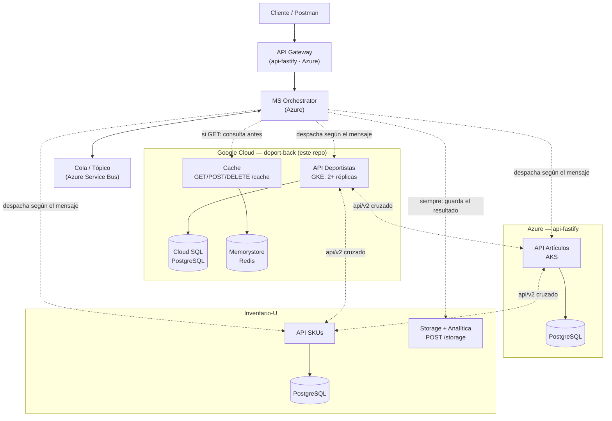

# deport-back

API REST para gestión deportiva (deportistas, hábitos, registros de entrenamiento y logros),
construida en **NestJS + Fastify + TypeORM/PostgreSQL**, desplegada en **Google Kubernetes
Engine** con base de datos gestionada, caché distribuida y autoescalado — y extendida con una
**integración cruzada en tiempo real** con las APIs de otros 2 equipos, desplegadas cada una en
una nube distinta (Azure y un tercer proveedor), como parte de un ejercicio de arquitectura
multicloud.

[](https://nestjs.com)
[](https://fastify.dev)
[](https://www.typescriptlang.org)
[](https://www.postgresql.org)
[](https://redis.io)
[](https://cloud.google.com/kubernetes-engine)
[](https://cloud.google.com)

## Qué resuelve este proyecto

Más allá del CRUD, el reto era construir una API que **no vive sola**: cada uno de los 3
integrantes del grupo despliega su propia API en una nube distinta, y las 3 se llaman entre sí
en tiempo real para componer respuestas combinadas — sin copiar datos, sin duplicar lógica, y
sin caerse si alguna de las otras 2 no responde. Este repo es la pieza de esa arquitectura que
me correspondía a mí: la API de **Deportistas**, desplegada en **GKE**, más el componente
transversal de **caché distribuida** que expongo para que el resto del sistema (el orquestador
del flujo, en otra nube) la use.

## Arquitectura



| Nube | Responsable | Componente propio | Componente transversal |
|---|---|---|---|
| **Google Cloud** | `deport-back` (este repo) | API Deportistas — GKE + Cloud SQL | **Cache** distribuida (Memorystore) |
| **Azure** | api-fastify | API Artículos — AKS + PostgreSQL | Orchestrator + Cola (Service Bus) + API Gateway |
| — | Inventario-U | API SKUs | Storage + Analítica |

Un `X-Trace-Id` se propaga en cada llamada entre nubes (lo detalla la sección
[Trace-id](#trace-id-correlación-entre-nubes) más abajo), así un mismo mensaje se puede seguir
extremo a extremo aunque cruce 3 proveedores distintos.

## Ingeniería de nube: qué está corriendo de verdad

No es un despliegue de juguete — corre en **GKE Autopilot** con lo que se le pide a un sistema en
producción:

- **2 réplicas mínimo**, autoescalado hasta 5 con `HorizontalPodAutoscaler` al 70% de CPU
- **Liveness y readiness probes** reales (con la excepción explícita de la ruta de healthcheck
  frente al guard de autenticación — un probe de Kubernetes no puede mandar headers custom)
- **Requests/limits** de CPU y memoria en cada contenedor
- **Configuración 100% externalizada**: `ConfigMap` para lo no sensible, `Secret` (leído de
  **Secret Manager**) para credenciales — nada de secretos en el código ni en el repo
- **Workload Identity**: el pod usa una identidad de GCP nativa para hablar con Cloud SQL y
  Secret Manager, sin una sola llave JSON de service account en ningún lado
- **Base de datos gestionada real** (Cloud SQL for PostgreSQL) vía el Cloud SQL Auth Proxy como
  sidecar del mismo pod
- **Caché gestionada real** (Memorystore for Redis), compartida entre todas las réplicas

### Retos reales que tocó diagnosticar y resolver en producción

| Problema | Causa raíz | Solución |
|---|---|---|
| Los pods quedaban en `CrashLoopBackOff` apenas se activó la API key compartida | El `readinessProbe`/`livenessProbe` de Kubernetes pega a `GET /` sin poder mandar el header `X-Api-Key` — el propio healthcheck se autobloqueaba | Excluir la ruta raíz del guard de autenticación, ya que es tráfico de infraestructura, no de negocio |
| Un rebuild con código nuevo seguía sirviendo la versión vieja | GKE Autopilot (Image Streaming) cachea la resolución del tag `:latest` y no siempre refleja un push reciente | Fijar el `deployment.yaml` al **digest exacto** de la imagen (`sha256:...`) en vez de al tag, forzando un pull inequívoco |
| El add-on de sincronización automática de Secret Manager → k8s nunca terminó de habilitarse | `GCE_STOCKOUT`: falta de capacidad transitoria de Google en la región para el driver CSI | Pivotar a un `Secret` de k8s creado a mano, leyendo los valores en vivo con `gcloud secrets versions access` — sin bloquear el resto del despliegue |
| Cloud SQL no arrancaba tras una pausa programada (para no gastar crédito) | Otro `STOCKOUT`, esta vez de cómputo en la región de la instancia | Recrear la instancia en **otra región**, reutilizando las mismas credenciales ya guardadas en Secret Manager — cero cambios en el `Secret` de k8s ni en el código |
| Control de costos durante el desarrollo | Cloud SQL, Memorystore y el `LoadBalancer` cobran por hora estando prendidos, sin importar el uso | Pausar Cloud SQL (`activation-policy=NEVER`), escalar la app a 0 réplicas y borrar Memorystore/el `Service` cuando no se estaba trabajando activamente; documentados los pasos exactos de reactivación |

## Qué incluye la API

**Dominio propio** (persistido en PostgreSQL):
- **Deportistas** — CRUD completo + búsqueda avanzada (`POST /deportistas/buscar`, y el método
  HTTP `QUERY` nativo, [RFC 10008](https://www.rfc-editor.org/rfc/rfc9110#QUERY))
- **Hábitos** — hábitos deportivos por deportista, con frecuencia configurable
- **Registros de entrenamiento** — historial de sesiones (RPE, duración, check-ins)
- **Logros** — se calculan sobre la marcha a partir de rachas y umbrales en los registros; no
  se persisten como entidad propia

**Integración multicloud (`api/v2`):**
- `GET /api/v2/deportistas/:id` — el mismo deportista, con la respuesta cruda de las otras 2
  APIs pegada en `apis_externas` (artículos de api-fastify, SKUs de Inventario-U), obtenida en
  vivo — nunca copiada ni persistida. Si alguna de las 2 no responde, la clave queda con
  `{ error }` y el resto de la respuesta sigue en pie.

**Componente transversal — Cache:**
- `GET /cache/:key`, `POST /cache`, `DELETE /cache/:key` — la caché distribuida (Redis) que uso
  internamente para no golpear a las otras 2 APIs en cada request, expuesta también por HTTP
  para que cualquier otro servicio del sistema (el Orchestrator) la use sin tener su propio Redis.

**Seguridad y trazabilidad:**
- `X-Api-Key` compartida entre los 3 equipos (fail-open si no está configurada, para no bloquear
  el desarrollo en paralelo)
- `X-Trace-Id` generado o propagado en cada petición, para correlacionar logs entre las 3 nubes

Documentación interactiva completa (Swagger/OpenAPI) en `/api-docs` una vez levantada la app.

## Stack técnico

| Capa | Tecnología |
|---|---|
| Framework | NestJS 11 sobre el adapter de **Fastify** (no Express) |
| Lenguaje | TypeScript 5.7 |
| ORM / base de datos | TypeORM + **PostgreSQL 16** |
| Caché | **Redis** (`ioredis`), con fallback gracioso si no responde |
| Llamadas externas | `fetch` nativo de Node 22 + `AbortController` (sin cliente HTTP externo) |
| Validación | `class-validator` / `class-transformer` |
| Documentación | Swagger / OpenAPI 3 |
| Tests | Jest (unit + e2e) |
| Contenedor | Docker (build multi-stage) |
| Orquestación | Kubernetes (**GKE Autopilot**) |
| Base de datos gestionada | **Cloud SQL for PostgreSQL** (Cloud SQL Auth Proxy como sidecar) |
| Caché gestionada | **Memorystore for Redis** |
| Secretos | **Secret Manager** |
| Exposición | `LoadBalancer` de GCP |
| Autoescalado | `HorizontalPodAutoscaler` (2 → 5 réplicas, 70% CPU) |

## Desarrollo local

```bash
pnpm install

# variables de entorno
copy .env.local.example .env.local

# levantar Postgres + Redis en Docker
docker compose up -d

# correr la API
pnpm run start:dev
```

Variables relevantes en `.env.local` (además de las de `DB_*`):

```
API_FASTIFY_URL=http://localhost:3001
INVENTARIO_U_URL=http://localhost:8000
REDIS_HOST=localhost
REDIS_PORT=6379
TEAM_API_KEY=<opcional — la API queda abierta si no se define>
```

## Tests

```bash
pnpm run test        # unit
pnpm run test:e2e    # end-to-end
pnpm run test:cov    # coverage
pnpm run test:docker # unit + e2e dentro de Docker
```

## Trace-id (correlación entre nubes)

Toda petición que llega recibe un `X-Trace-Id`: si ya lo trae (porque viene del Gateway o del
Orchestrator, que lo deben propagar), se respeta; si no, se genera uno nuevo con
`crypto.randomUUID()`. Se devuelve en el header de la respuesta, se manda como header hacia
`api-fastify` e `Inventario-U` en las llamadas del `api/v2`, y queda en los logs de la app — así
un mismo mensaje se puede seguir en `kubectl logs` aunque haya cruzado 3 nubes distintas.

## Despliegue en Google Cloud (GKE)

Manifiestos de Kubernetes en [`k8s/`](k8s) para GKE Autopilot. Sin pipeline de CI/CD — el deploy
es manual, a propósito (ejercicio académico de una sola vez).

| Archivo | Qué configura |
|---|---|
| `namespace.yaml` | Namespace `deport-back` |
| `configmap.yaml` | Config no sensible: host del proxy de Cloud SQL, URLs de las otras 2 APIs, host de Redis |
| `serviceaccount.yaml` | ServiceAccount con Workload Identity (`cloudsql.client`, `secretmanager.secretAccessor`) |
| `deployment.yaml` | 2 réplicas + sidecar del Cloud SQL Auth Proxy, probes de liveness/readiness, requests/limits |
| `service.yaml` | `LoadBalancer` para exponer la app |
| `hpa.yaml` | Autoescala de 2 a 5 réplicas al 70% de CPU |

<details>
<summary><strong>Pasos completos de despliegue desde cero</strong></summary>

Build y push de la imagen a Artifact Registry:

```bash
gcloud builds submit --tag <region>-docker.pkg.dev/<project-id>/deport-back/deport-back:latest .
```

> GKE Autopilot puede cachear el tag `:latest` (Image Streaming) y servir una imagen vieja tras
> un rebuild — para desplegar con certeza, fijar el `deployment.yaml` al **digest exacto**
> (`gcloud artifacts docker images describe ... --format='value(image_summary.digest)'`) en vez
> del tag.

Service account de GCP y permisos (una sola vez):

```bash
gcloud iam service-accounts create deport-back-sa
gcloud projects add-iam-policy-binding <project-id> \
  --member="serviceAccount:deport-back-sa@<project-id>.iam.gserviceaccount.com" \
  --role="roles/cloudsql.client"
gcloud projects add-iam-policy-binding <project-id> \
  --member="serviceAccount:deport-back-sa@<project-id>.iam.gserviceaccount.com" \
  --role="roles/secretmanager.secretAccessor"
gcloud iam service-accounts add-iam-policy-binding \
  deport-back-sa@<project-id>.iam.gserviceaccount.com \
  --role roles/iam.workloadIdentityUser \
  --member "serviceAccount:<project-id>.svc.id.goog[deport-back/deport-back-sa]"
```

Memorystore for Redis (anotar la IP interna para `configmap.yaml`):

```bash
gcloud services enable redis.googleapis.com
gcloud redis instances create deport-back-cache \
  --size=1 --region=<region> --tier=basic --redis-version=redis_7_0
gcloud redis instances describe deport-back-cache --region=<region> --format='value(host)'
```

Secret de k8s, leyendo las credenciales directo de Secret Manager:

```bash
kubectl create secret generic deport-back-db -n deport-back \
  --from-literal=DB_USERNAME="$(gcloud secrets versions access latest --secret=db-username)" \
  --from-literal=DB_PASSWORD="$(gcloud secrets versions access latest --secret=db-password)" \
  --from-literal=DB_NAME="$(gcloud secrets versions access latest --secret=db-name)" \
  --from-literal=TEAM_API_KEY="$(gcloud secrets versions access latest --secret=team-api-key)"
```

Aplicar todo:

```bash
kubectl apply -f k8s/namespace.yaml
kubectl apply -f k8s/configmap.yaml
kubectl apply -f k8s/serviceaccount.yaml
kubectl apply -f k8s/deployment.yaml
kubectl apply -f k8s/service.yaml
kubectl apply -f k8s/hpa.yaml
```

</details>

## Estructura del proyecto

```
src/
├── deportistas/    # dominio propio: entidad, controllers (v1 y v2), service, DTOs
├── habitos/
├── registros/
├── logros/         # calculado, sin entidad propia
├── cache/           # componente transversal expuesto por HTTP
└── common/
    ├── http-externo/       # cliente fetch con timeout, sin dependencias externas
    ├── cache-distribuida/  # cliente Redis con fallback gracioso
    ├── team-api-key/       # guard de autenticación entre los 3 equipos
    └── trace-id/           # correlación de peticiones entre nubes
k8s/                 # manifiestos de despliegue en GKE
```

## Licencia

Proyecto académico — Universidad de Medellín, Ingeniería de Sistemas.
